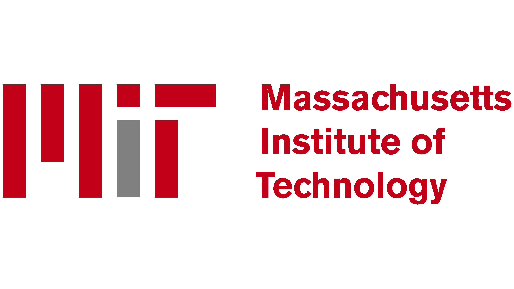
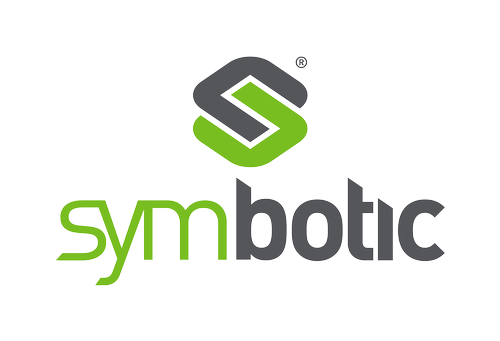

<div align="center">

# RL-RH-PP: Learning-guided Prioritized Planning for Lifelong Multi-Agent Path Finding

<p>
  
  &nbsp;&nbsp;&nbsp;&nbsp;&nbsp;&nbsp;
  
</p>

**[Han Zheng](https://mikezheng777.github.io/), [Yining Ma](https://yining043.github.io), [Brandon Araki](https://braraki.github.io), [Jingkai Chen](https://jkchengh.github.io), [Cathy Wu](https://www.wucathy.com)**

<p>
  <a href="https://doi.org/10.1613/jair.1.20611"></a>
  <a href="https://doi.org/10.1613/jair.1.20611"></a>
  <a href="https://www.python.org/"></a>
  <a href="https://pytorch.org/"></a>
</p>

<p>
  <a href="#installation">Installation</a> •
  <a href="#usage">Usage</a> •
  <a href="#cli-reference">CLI Reference</a> •
  <a href="#citation">Citation</a>
</p>


https://github.com/user-attachments/assets/5e1d1dfe-51cf-48b4-85dd-f4a02148b3d9


<!-- TODO: drag-drop comparison_animation.mp4 into the GitHub README editor to get an inline video URL, then paste it here -->

</div>

---

## Project Structure

```
RL-RH-PP/
├── src/                    # C++ MAPF solvers and simulation (pybind11)
├── inc/                    # C++ headers
├── RL/
│   ├── agent.py            # PPO agent, actor-critic, training loop
│   ├── network.py          # GNN encoder, attention decoder
│   ├── gym_env.py          # OpenAI Gym wrapper for C++ environment
│   └── utils.py            # Config class, map loader, gradient plotting
├── maps/                   # Warehouse maps and precomputed heuristic tables
├── train.py             # Training entry point
├── config.yaml             # Example configuration (optional)
└── CMakeLists.txt          # C++ build configuration
```

## Installation

### 1. System dependencies

```bash
sudo apt install libboost-all-dev cmake build-essential
```

### 2. Python environment

```bash
conda create -n rl-rhpp python=3.9
conda activate rl-rhpp
pip install torch pybind11 tianshou tensorboard-logger pyyaml gym gymnasium shimmy numpy tqdm matplotlib "protobuf<4"
```

### 3. Build C++ module

```bash
mkdir build && cd build
cmake ..
make -j$(nproc)
cd ..
```

This produces `build/python/warehouse_sim.*.so`, the pybind11 module used by the training code.

## Usage

### Train on Symbotic (default)

```bash
python train.py
```

Trains with 80 agents on the Symbotic warehouse. Results saved to `./exp/<timestamp>_RL_symbotic_80_agents/`.

### Train on KIVA

```bash
python train.py --scenario KIVA
```

### Override parameters

```bash
python train.py --agent_num 120 --kappa 500 --num_epochs 2000 --gpu 2
```

### Use a config file

```bash
python train.py --config config.yaml
```

CLI args take precedence over config file values.

### Resume / Transfer learning

```bash
# Resume from checkpoint
python train.py --checkpoint exp/.../epoch-100-5000.pt

# Transfer learning (reset optimizer, keep weights)
python train.py --checkpoint exp/.../epoch-100-5000.pt --transfer_learning
```

### Monitor training

```bash
tensorboard --logdir exp/ --port 6006
```

## CLI Reference

| Argument | Description | Default |
|:---|:---|:---:|
| `--scenario` | Warehouse type (`SYMBOTIC`, `KIVA`) | `SYMBOTIC` |
| `--agent_num` | Number of agents | `80` |
| `--kappa` | Reward shaping parameter | `1000` |
| `--planning_window` | Planning horizon (w) | `20` |
| `--simulation_window` | Replanning period (h) | `5` |
| `--simulation_time` | Total simulation timesteps | `800` |
| `--num_epochs` | Training epochs | `4000` |
| `--num_cpus` | Parallel environments | `16` |
| `--lr` | Learning rate (actor and critic) | `0.001` |
| `--batch_size` | Batch size | `32` |
| `--seed` | Random seed | `0` |
| `--gpu` | GPU device index (`-1` for CPU) | `0` |
| `--no_tb` | Disable TensorBoard logging | |
| `--checkpoint` | Resume from checkpoint file | |
| `--transfer_learning` | Reset optimizer when resuming | |
| `--config` | Path to YAML config file | |
| `--save_dir` | Custom output directory | auto |
| `--map` | Custom map file path | auto |

## Maps

| Map | Scenario | Description |
|:---|:---|:---|
| `maps/symbotic.map` | SYMBOTIC | Automated warehouse with aisle structures |
| `maps/kiva.map` | KIVA | Fulfillment warehouse with pod storage |

Each map has a precomputed heuristics table (`*_heuristics_table.txt`) for efficient A* pathfinding.

## Citation

If you find this work useful, please cite:

```bibtex
@article{zheng2026learning,
  title={Learning-guided Prioritized Planning for Lifelong Multi-Agent Path Finding in Warehouse Automation},
  author={Zheng, Han and Ma, Yining and Araki, Brandon and Chen, Jingkai and Wu, Cathy},
  journal={Journal of Artificial Intelligence Research},
  volume={85},
  year={2026},
  doi={10.1613/jair.1.20611}
}
```

## Acknowledgements

The C++ MAPF simulation backend is built upon [RHCR](https://github.com/Jiaoyang-Li/RHCR) by Jiaoyang Li, Andrew Tinka, Scott Kiesel, Joseph W. Durham, T. K. Satish Kumar, and Sven Koenig. We thank the authors for making their code publicly available.

## License

The RHCR simulation code (`src/`, `inc/`) is subject to the USC Research License. See [license.md](license.md) for details.
